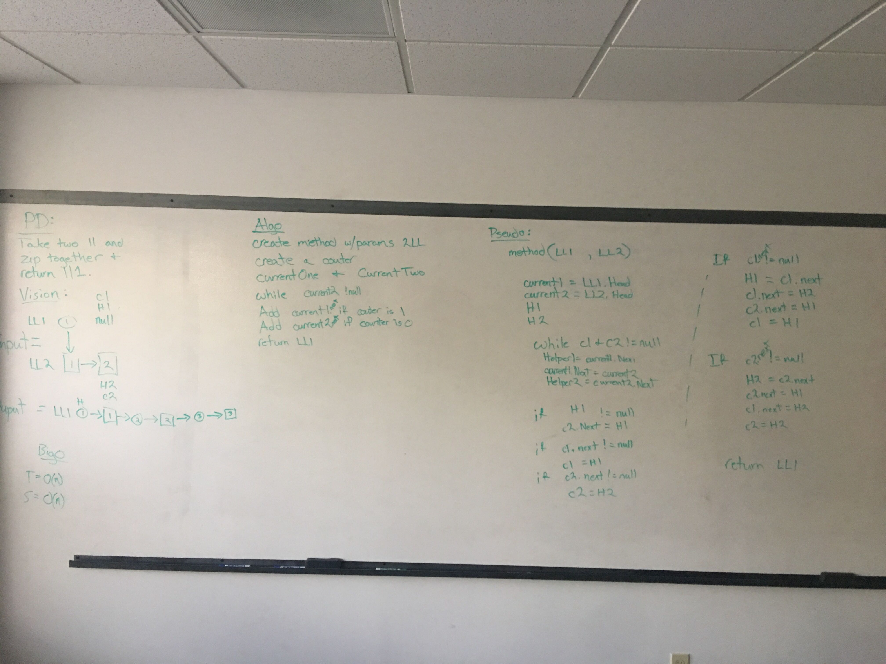
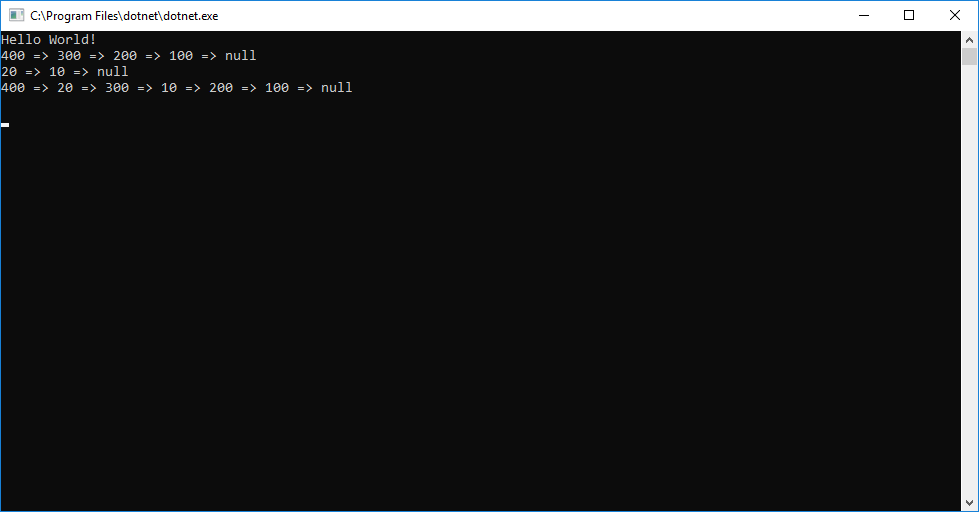

<h1>ZipZip</h1>

<h2> Summary </h2>

This code challenge was made to really make us engage and get comfortable with passing nodes from one to another without losing nodes. 
This one was really fun on the whiteboard, I really utilized the vision portion of my whiteboard while testing my pseudo code.  I would 
adjust my visual to help me keep track of where I was and where things were pointing.  REALLY GREAT CHALLENGE!

<h2> Challenges </h2>

Write a method that takes in two linked lists and return the first linked list with the second zipped into it.

<h2> Approach </h2>

I had a pretty good visual idea in my head what I wanted to accomplish, passing things back and forth.  However as I was thinking about 
possible issues I realized my logic I enitially wrote wasnt gonna work unless both LL were the same length.

<h2> Solution </h2>

In the end I had less code then with my original Idea.  Less is not always more, but in this situation it was.  When solving this problem 
really latch on to the visual portion of your board really helps you work that solution without getting lost in your pseudo code.