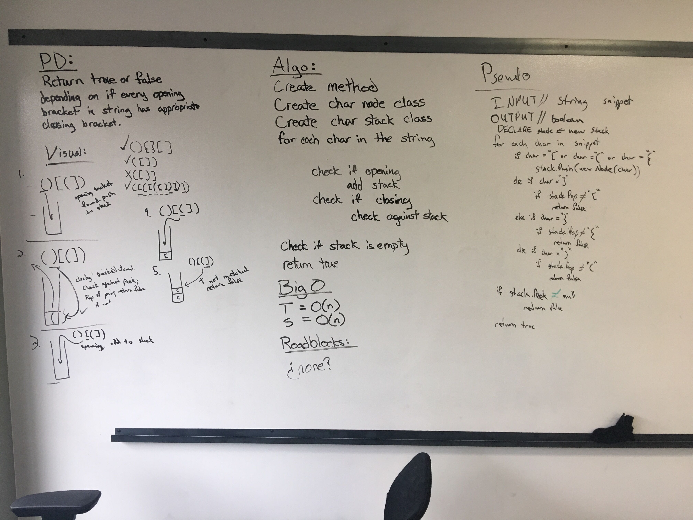

<h1> Multi Bracket Validation </h1>

<h3> Summary </h3>

Write a method that takes a string as its only argument, and should return a boolean representing whether or not the brackets in the string are balanced. 

<h3> Challenge </h3>

- White board the summary.
- Code out white board.
- Write tests for Code.
- Write Readme for challenge.

<h3> White Board </h3>

