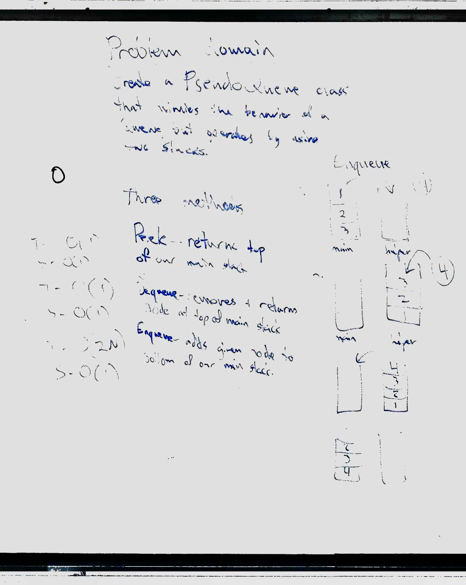
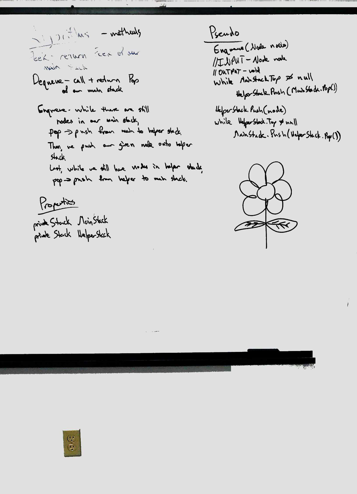

<h1> Queue With Stacks </h1>

<h3> Summary </h3>

This challenge was to make sure we had a good handle on both stacks and queues individually by implementing them together.  It really makes you break down 
the function of both classes when writing out this PseudoQueue.  

<h3> Challenge </h3>

Creat a PseudoQueue class that mimics the behavior of a Queue but operates like a Stack.  I.E. Using two stacks 
have the stacks funtion using F.I.F.O and L.I.L.O instead of the stack rules of L.I.F.O 
and F.I.L.O.

<h3> Efficiency </h3>

This is the first time I felt it was actually worth adding a Efficiency portion!  After we completed our whiteboard, 
and started coding we realized that we could do our logic much more efficient than what we whiteboarded. 
So our code implementatin does not match our whiteboard.

