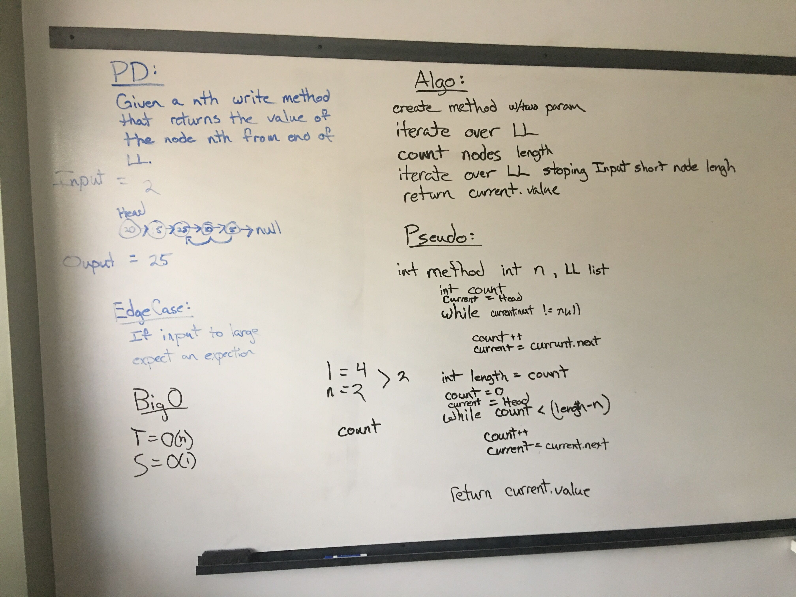

<h1> LLFromEnd</h1>

<h2>Summary</h2>

Given a kth, write a method that returns the value of the node kth from the end of the Linked List.

<h2> Challenges </h2>

Being new to Linked List the first challenge that came to mind was its not as easy as array because array has .Length by default.
There is no way to know the length of a LL right off the bat.  So I decided first thing I got to do is find the length.  I decided 
to take the logic we are used to with the while loop and just add a count to it as it iterates over the LL.  Giving me the length. 
I then checked to see if the kth number requested was even possible before doing any further logic.  If not it will return -1.  
If possible it will I do some quick math to find how many times I need to iterate over the LL starting from the head and then return the value 
of that node!

<h2> Approach/Efficiency </h2>

So Im iterating over the LL twice if its a valid option to look for, I did add logic to check if the LL was long enough for the 
inputed kth.  So at a minimum it will iterate Once finding the length, then depending on the check logic will it either return 
or it will loop as far as its needed to get to the specific value being asked for.

