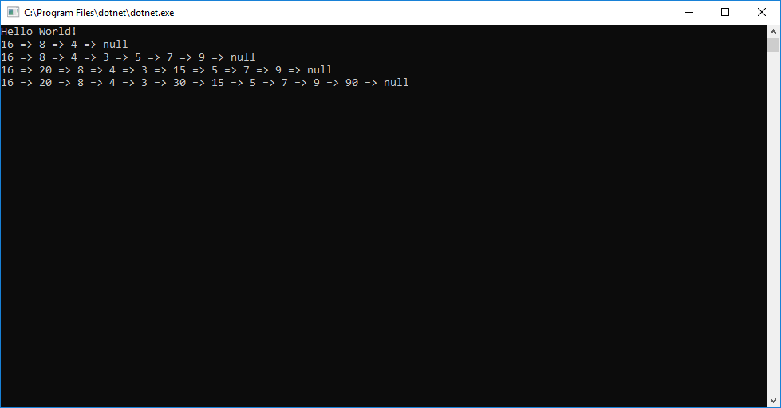

<h1>Summary</h1>

This project displays the values of each node in a generated Linked list displayed in the console.

<h2>Challenge</h2>

-Properly generate a Node with both value and reference  
-create a head of a linked list   
-create a insert method that takes a value and adds it to the front of the LL  
-create a includes method that checks a value agaisnt all values in the ll and returns true if found or false if not found  
-create a print method that displays the values of all Nodes in the LL in the console  

<h2>Setup: </h2>

-Open VS community  
-Create new project  
-Go to File  
-New  
-New Project  
-In the window on the left you will see a .NET Core option under Visual C# make sure you have that selected  
-Now in the middle section select Console App (.NET Core)  
-Next in the bottom change the name to your choice and change path if you want and then click "Ok"  
-Next click view  
-Then Solution Explorer  
-If it wasnt already there it will open a tab on the right side showing your Solution Explorer  
-Next click on the tiny folder tab in the Solution explorer tab the change to Solution Explorer - Folder View  
-Navigate to Program.cs file and double click to open it  
-Once you have that open copy and paste the source code below into the Program.cs file  
-Hit control S to save the source code you pasted into your file  
-Now go back up to the Solution Explorer - Folder View and hit the little folder tab to change back to the just the Solution Explorer  
-Now its time to run the code in the top nav bar hit Debug  
-Then Click Start Debug to get access to Tylers money!  

